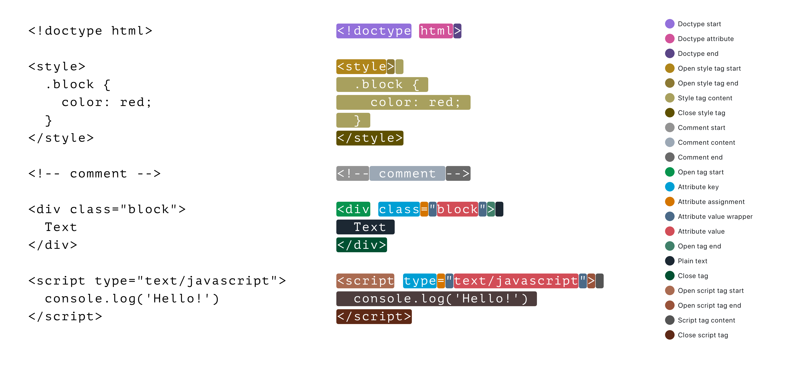

<p align="center">


</p>

# Hyntax

Straightforward HTML parser for JavaScript. [Live Demo](https://astexplorer.net/#/gist/6bf7f78077333cff124e619aebfb5b42/latest).

-   **Simple.** API is straightforward, output is clear.
-   **Forgiving.** Just like a browser, normally parses invalid HTML.
-   **Supports streaming.** Can process HTML while it's still being loaded.
-   **No dependencies.**


## Table Of Contents

-   [Usage](#usage)
-   [TypeScript Typings](#typescript-typings)
-   [Streaming](#streaming)
-   [Tokens](#tokens)
-   [AST Format](#ast-format)
-   [API Reference](#api-reference)
-   [Types Reference](#types-reference)


## Usage

```bash
npm install hyntax
```

```javascript
const { tokenize, constructTree } = require('hyntax')
const util = require('util')

const inputHTML = `
<html>
  <body>
      <input type="text" placeholder="Don't type">
      <button>Don't press</button>
  </body>
</html>
`

const { tokens } = tokenize(inputHTML)
const { ast } = constructTree(tokens)

console.log(JSON.stringify(tokens, null, 2))
console.log(util.inspect(ast, { showHidden: false, depth: null }))
```

## TypeScript Typings

Hyntax is written in JavaScript but has [integrated TypeScript typings](./index.d.ts) to help you navigate around its data structures. There is also [Types Reference](#types-reference) which covers most common types.


## Streaming

Use `StreamTokenizer` and `StreamTreeConstructor` classes to parse HTML chunk by chunk while it's still being loaded from the network or read from the disk.

```javascript
const { StreamTokenizer, StreamTreeConstructor } = require('hyntax')
const http = require('http')
const util = require('util')

http.get('http://info.cern.ch', (res) => {
  const streamTokenizer = new StreamTokenizer()
  const streamTreeConstructor = new StreamTreeConstructor()

  let resultTokens = []
  let resultAst

  res.pipe(streamTokenizer).pipe(streamTreeConstructor)

  streamTokenizer
    .on('data', (tokens) => {
      resultTokens = resultTokens.concat(tokens)
    })
    .on('end', () => {
      console.log(JSON.stringify(resultTokens, null, 2))
    })

  streamTreeConstructor
    .on('data', (ast) => {
      resultAst = ast
    })
    .on('end', () => {
      console.log(util.inspect(resultAst, { showHidden: false, depth: null }))
    })
}).on('error', (err) => {
  throw err;
})
```


## Tokens

Here are all kinds of tokens which Hyntax will extract out of HTML string.



Each token conforms to [Tokenizer.Token](#TokenizerToken) interface.


## AST Format

Resulting syntax tree will have at least one top-level [Document Node](#ast-node-types) with optional children nodes nested within.

<!-- You can play around with the [AST Explorer](https://astexplorer.net) to see how AST looks like. -->

```javascript
{
  nodeType: TreeConstructor.NodeTypes.Document,
  content: {
    children: [
      {
        nodeType: TreeConstructor.NodeTypes.AnyNodeType,
        content: {…}
      },
      {
        nodeType: TreeConstructor.NodeTypes.AnyNodeType,
        content: {…}
      }
    ]
  }
}
```

Content of each node is specific to node's type, all of them are described in [AST Node Types](#ast-node-types) reference.


## API Reference

### Tokenizer

Hyntax has its tokenizer as a separate module. You can use generated tokens on their own or pass them further to a tree constructor to build an AST.

#### Interface

```typescript
tokenize(html: String): Tokenizer.Result
```

#### Arguments

-   `html`  
HTML string to process  
  Required.  
Type: string.

#### Returns [Tokenizer.Result](#TokenizerResult)

### Tree Constructor

After you've got an array of tokens, you can pass them into tree constructor to build an AST.

#### Interface

```typescript
constructTree(tokens: Tokenizer.AnyToken[]): TreeConstructor.Result
```

#### Arguments

-   `tokens`  
Array of tokens received from the tokenizer.  
  Required.  
Type: [Tokenizer.AnyToken[]](#tokenizeranytoken)

#### Returns [TreeConstructor.Result](#TreeConstructorResult)


## Types Reference

#### Tokenizer.Result

```typescript
interface Result {
  state: Tokenizer.State
  tokens: Tokenizer.AnyToken[]
}
```

-   `state`   
The current state of tokenizer. It can be persisted and passed to the next tokenizer call if the input is coming in chunks.
-   `tokens`  
  Array of resulting tokens.  
  Type: [Tokenizer.AnyToken[]](#tokenizeranytoken)

#### TreeConstructor.Result

```typescript
interface Result {
  state: State
  ast: AST
}
```

-   `state`  
The current state of the tree constructor. Can be persisted and passed to the next tree constructor call in case when tokens are coming in chunks.
  
-   `ast`  
  Resulting AST.  
  Type: [TreeConstructor.AST](#treeconstructorast)  

#### Tokenizer.Token

Generic Token, other interfaces use it to create a specific Token type.

```typescript
interface Token<T extends TokenTypes.AnyTokenType> {
  type: T
  content: string
  startPosition: number
  endPosition: number
}
```

-   `type`  
One of the [Token types](#TokenizerTokenTypesAnyTokenType).
  
-   `content `   
Piece of original HTML string which was recognized as a token.
  
-   `startPosition `   
Index of a character in the input HTML string where the token starts.
  
-   `endPosition`  
Index of a character in the input HTML string where the token ends.

#### Tokenizer.TokenTypes.AnyTokenType

Shortcut type of all possible tokens.

```typescript
type AnyTokenType =
  | Text
  | OpenTagStart
  | AttributeKey
  | AttributeAssigment
  | AttributeValueWrapperStart
  | AttributeValue
  | AttributeValueWrapperEnd
  | OpenTagEnd
  | CloseTag
  | OpenTagStartScript
  | ScriptTagContent
  | OpenTagEndScript
  | CloseTagScript
  | OpenTagStartStyle
  | StyleTagContent
  | OpenTagEndStyle
  | CloseTagStyle
  | DoctypeStart
  | DoctypeEnd
  | DoctypeAttributeWrapperStart
  | DoctypeAttribute
  | DoctypeAttributeWrapperEnd
  | CommentStart
  | CommentContent
  | CommentEnd
```

#### Tokenizer.AnyToken

Shortcut to reference any possible token.

```typescript
type AnyToken = Token<TokenTypes.AnyTokenType>
```

#### TreeConstructor.AST

Just an alias to DocumentNode. AST always has one top-level DocumentNode. See [AST Node Types](#ast-node-types)

```typescript
type AST = TreeConstructor.DocumentNode
```

### AST Node Types

There are 7 possible types of Node. Each type has a specific content.

```typescript
type DocumentNode = Node<NodeTypes.Document, NodeContents.Document>	
```

```typescript
type DoctypeNode = Node<NodeTypes.Doctype, NodeContents.Doctype>
```

```typescript
type TextNode = Node<NodeTypes.Text, NodeContents.Text>
```

```typescript
type TagNode = Node<NodeTypes.Tag, NodeContents.Tag>
```

```typescript
type CommentNode = Node<NodeTypes.Comment, NodeContents.Comment>
```

```typescript
type ScriptNode = Node<NodeTypes.Script, NodeContents.Script>
```

```typescript
type StyleNode = Node<NodeTypes.Style, NodeContents.Style>
```

Interfaces for each content type:

- [Document](#TreeConstructorNodeContentsDocument)
- [Doctype](#TreeConstructorNodeContentsDoctype)
- [Text](#TreeConstructorNodeContentsText)
- [Tag](#TreeConstructorNodeContentsTag)
- [Comment](#TreeConstructorNodeContentsComment)
- [Script](#TreeConstructorNodeContentsScript)
- [Style](#TreeConstructorNodeContentsStyle)

#### TreeConstructor.Node

Generic Node, other interfaces use it to create specific Nodes by providing type of Node and type of the content inside the Node.

```typescript
interface Node<T extends NodeTypes.AnyNodeType, C extends NodeContents.AnyNodeContent> {
  nodeType: T
  content: C
}
```

#### TreeConstructor.NodeTypes.AnyNodeType

Shortcut type of all possible Node types.

```typescript
type AnyNodeType =
  | Document
  | Doctype
  | Tag
  | Text
  | Comment
  | Script
  | Style
```

### Node Content Types

#### TreeConstructor.NodeTypes.AnyNodeContent

Shortcut type of all possible types of content inside a Node.

```typescript
type AnyNodeContent =
  | Document
  | Doctype
  | Text
  | Tag
  | Comment
  | Script
  | Style
```

#### TreeConstructor.NodeContents.Document

```typescript
interface Document {
  children: AnyNode[]
}
```

#### TreeConstructor.NodeContents.Doctype

```typescript
interface Doctype {
  start: Tokenizer.Token<Tokenizer.TokenTypes.DoctypeStart>
  attributes?: DoctypeAttribute[]
  end: Tokenizer.Token<Tokenizer.TokenTypes.DoctypeEnd>
}
```

#### TreeConstructor.NodeContents.Text

```typescript
interface Text {
  value: Tokenizer.Token<Tokenizer.TokenTypes.Text>
}
```

#### TreeConstructor.NodeContents.Tag

```typescript
interface Tag {
  name: string
  selfClosing: boolean
  openStart: Tokenizer.Token<Tokenizer.TokenTypes.OpenTagStart>
  attributes?: TagAttribute[]
  openEnd: Tokenizer.Token<Tokenizer.TokenTypes.OpenTagEnd>
  children?: AnyNode[]
  close: Tokenizer.Token<Tokenizer.TokenTypes.CloseTag>
}
```

#### TreeConstructor.NodeContents.Comment

```typescript
interface Comment {
  start: Tokenizer.Token<Tokenizer.TokenTypes.CommentStart>
  value: Tokenizer.Token<Tokenizer.TokenTypes.CommentContent>
  end: Tokenizer.Token<Tokenizer.TokenTypes.CommentEnd>
}
```

#### TreeConstructor.NodeContents.Script

```typescript
interface Script {
  openStart: Tokenizer.Token<Tokenizer.TokenTypes.OpenTagStartScript>
  attributes?: TagAttribute[]
  openEnd: Tokenizer.Token<Tokenizer.TokenTypes.OpenTagEndScript>
  value: Tokenizer.Token<Tokenizer.TokenTypes.ScriptTagContent>
  close: Tokenizer.Token<Tokenizer.TokenTypes.CloseTagScript>
}
```

#### TreeConstructor.NodeContents.Style

```typescript
interface Style {
  openStart: Tokenizer.Token<Tokenizer.TokenTypes.OpenTagStartStyle>,
  attributes?: TagAttribute[],
  openEnd: Tokenizer.Token<Tokenizer.TokenTypes.OpenTagEndStyle>,
  value: Tokenizer.Token<Tokenizer.TokenTypes.StyleTagContent>,
  close: Tokenizer.Token<Tokenizer.TokenTypes.CloseTagStyle>
}
```

#### TreeConstructor.DoctypeAttribute

```typescript
interface DoctypeAttribute {
  startWrapper?: Tokenizer.Token<Tokenizer.TokenTypes.DoctypeAttributeWrapperStart>,
  value: Tokenizer.Token<Tokenizer.TokenTypes.DoctypeAttribute>,
  endWrapper?: Tokenizer.Token<Tokenizer.TokenTypes.DoctypeAttributeWrapperEnd>
}
```

#### TreeConstructor.TagAttribute

```typescript
interface TagAttribute {
  key?: Tokenizer.Token<Tokenizer.TokenTypes.AttributeKey>,
  startWrapper?: Tokenizer.Token<Tokenizer.TokenTypes.AttributeValueWrapperStart>,
  value?: Tokenizer.Token<Tokenizer.TokenTypes.AttributeValue>,
  endWrapper?: Tokenizer.Token<Tokenizer.TokenTypes.AttributeValueWrapperEnd>
}
```
